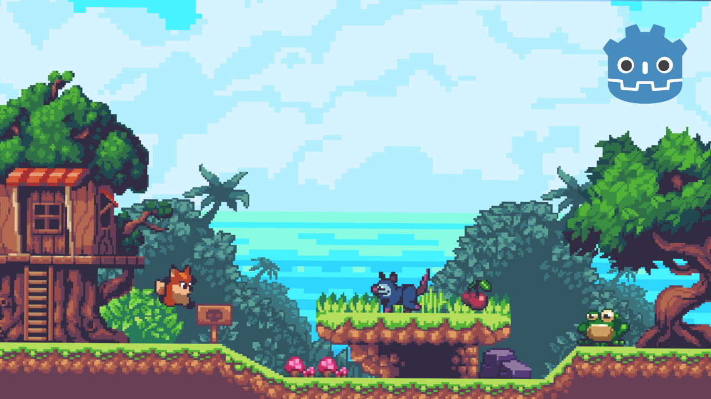

# Godot 2D adventure platformer demo

Godot 2D adventure platformer demo of Sunny Land. [Watch full tutorial video on YouTube]()! 

➡ Follow me on [Twitter](https://twitter.com/VenexSource) and [YouTube](https://www.youtube.com/@venex_source) for more godot game tutorials, and more!

## What you'll learn
- Build a platform game with connected levels, player, enemies, coins, level transition...
- Basic AI enemy that chase the player and avoids danger like Spikes
- Learn these two concept **Inheritance** and **Composition**(Components), and how harness them and create better games.
- Design a title screen, a health and coin counter and a lot more.

Feel free to [ open an issue ]() and submit a Pull Request if you find bugs!

## How to get started
1. Download and Install the [Godot Engine](https://godotengine.org/) **(v.4.0 and above)**.
2. Download the [project file]() for the tutorial.
3. Open up the Godot Engine and import the **start** project file. 

We also recommend having a basic understanding of GDScript and a fundamentals of the godot engine. Checkout the [Your First 2D Game]() in the official Godot docs, if you haven't already.

## Features
### Player
A basic platformer character that has the ability to:
- Jump
- Stomp on enemies
- Detect Hits
- Collect coins and live(cherry)
### Enemies
- **Frog:** A basic AI enemy that jumps & chase the player once detected, returns to his idle state when player out of range.
- **Opossum:** Basic Patrolling enemy that run's after player if detected and avoids danger(Spike).

### Interface & GUI
- Coin and Health Counter
- Main screen
- Level Transition(Fade-In)

### Keys
**Move** - WASD or Arrow keys
**Jump** - Space bar

## Other Links
1. [Learn Godot Inheritance]()
2. [Learn these 4 2D Platforms]() 

**Check out my YouTube Channel** [Venex Source](https://www.youtube.com/@venex_source)

## Credits
Special thanks to the author's for providing the asset used in this tutorial video. Your creative contribution is greatly appreciated.
- Sprites by [**ansimuz**](https://ansimuz.itch.io/sunny-land-pixel-game-art)
- Font by [**Kenny**](https://www.kenney.nl)